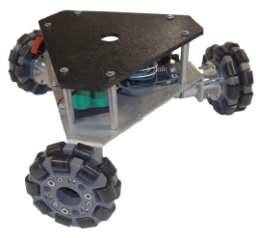
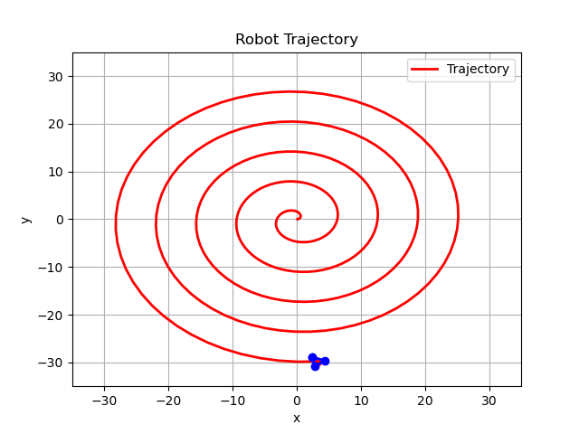
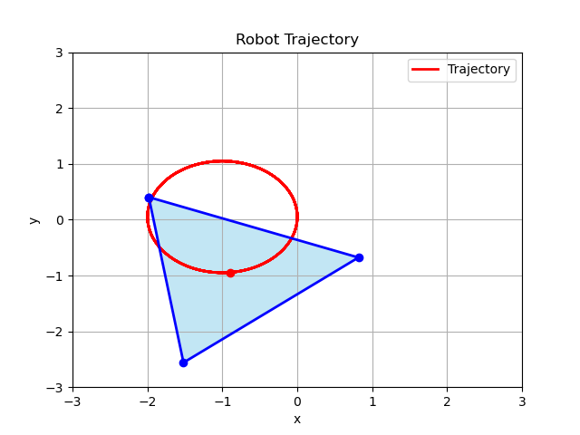

# A Simple Simulation Environment for a Three-Wheeled Omnidirectional Robot

## Overview

This repository provides a basic implementation of a simulation environment for a three-wheeled omnidirectional robot, which is shown in the following image. The implementation is based on chapter thirteen of the Modern Robotics Book. The simulation environment provides the user with a top view of the robot's trajectory and its orientation in each time step. Additionally, the robot's pose, θ, x, y, vs time is plotted. The robot's characteristics as well as the running time can be changed.


*Image is taken from the Modern Robotics Book<br>
<p></p>
<p></p>
The following are some images from the environment:



*Robot in an expanding spiral trajectory


*Robot in a circle trajectory while its orientation is changing

## Getting Started

### Clone the Repository

```bash
git clone https://github.com/SajjiKazemi/3wheeled_omniwheel_robot.git
```

## Dependencies
Create a virtual environment using the provided robot_env.yml file in the /utils directory:

```bash
conda env create -f robot_env.yml
```
Activate the environment:

```bash
conda activate robot_env
```

## Usage
To use the simulation environment you can use either the main.py file or the notebook.ipynb file.

## Contact
For any questions or feedback, feel free to reach out:

Email: sajjikazemi@uwaterloo.ca

LinkedIn: www.linkedin.com/in/sajjadkazemi
